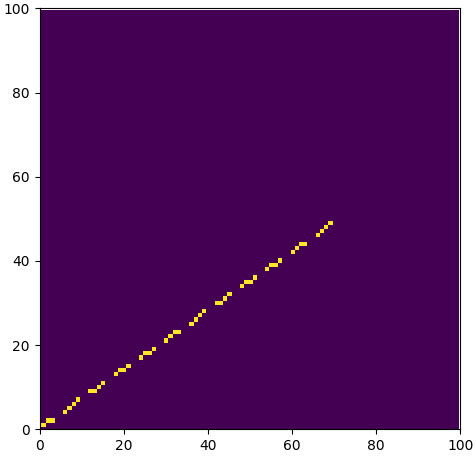
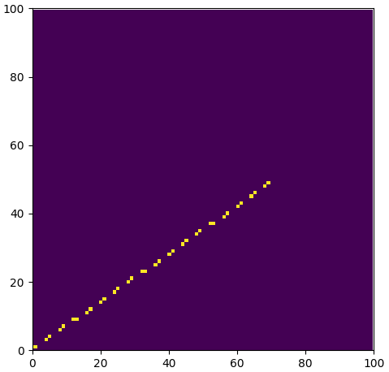
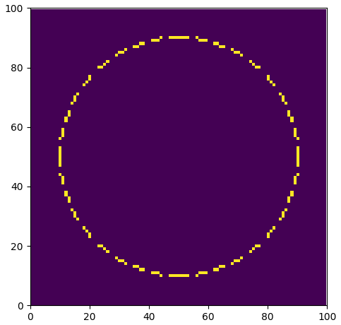
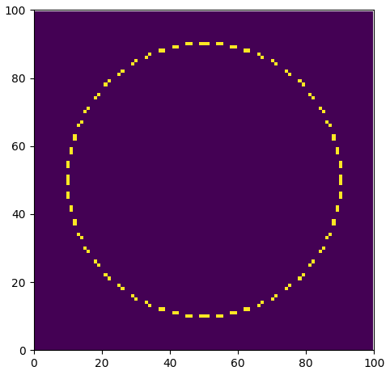

# 思考题二 「线有线型时的改进算法」

[TOC]

------

## 直线段

### 算法思想

- 用01位串存放线型

  > 例. 位串111100代表的线型为
  >
  > |----  ----  ----  ----  ----  ----  ----  |

### 算法实现

- 将用户输入的01位串转换为“布尔”数组

  ```python
  linetype_str = input('请输入0和1组成的字串: ')
  linetype = list(map(int, list(linetype_str)))
  ```

- 定义循环计数器，将计数器对用户输入的线型做运算，在用户希望标实线的位置进行绘制，留出空白段

  ```python
  if linetype[counter % len(linetype)]:
    	drawPixel(x, y, 1, grid)
  ```

### 算法效果

**111100**



**1100**



### 算法评价

- **缺点**
  - 采用固定长度的实现方法会在不同直线方向上产生出不等长的划线段（相同个数的像素沿不同方向将生成不同长度的线段）
- **解决方法：**
  1. 按照直线的斜率调整位串中实线段和空白段段像素树木
  2. 对线段按照长度进行处理，而不是按照像素个数进行处理
  3. 将整条直线提前进行分段，确定每一段的终点坐标，再调用直线段的扫描转换算法绘制具有线性的直线段

------

## 圆弧

### 算法效果

**111100**



**1100**

