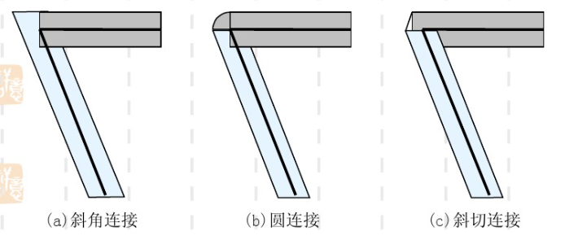

# 思考题一 「线有线宽时的改进算法」

Table of Contents
=================

   * [思考题一 「线有线宽时的改进算法」](#思考题一-线有线宽时的改进算法)
      * [直线段](#直线段)
         * [线刷子](#线刷子)
            * [算法思想](#算法思想)
            * [算法实现](#算法实现)
            * [算法效果](#算法效果)
            * [算法评价](#算法评价)
         * [正方形刷子](#正方形刷子)
            * [算法思想](#算法思想-1)
            * [算法实现](#算法实现-1)
            * [算法效果](#算法效果-1)
            * [算法评价](#算法评价-1)
         * [区域填充](#区域填充)
            * [算法思想](#算法思想-2)
            * [算法评价](#算法评价-2)
      * [圆弧](#圆弧)
         * [线刷子](#线刷子-1)
            * [算法思想](#算法思想-3)
            * [算法实现](#算法实现-2)
            * [算法效果](#算法效果-2)
         * [正方形刷子](#正方形刷子-1)
            * [算法实现](#算法实现-3)
            * [算法效果](#算法效果-3)
------

## 直线段

### 线刷子

#### 算法思想

按照原始的直线段的扫描转换算法点亮栅格中的像素，与此同时在每次点亮的时候用一个具有一定宽度的“线刷子”点亮构成宽度的像素

- 按照**直线斜率**进行分类
  - [-1, 1], 线刷子为垂直方向，将线刷子的中心店对准直线上的各个点
  - otherwise, 线刷子为水平方向

#### 算法实现

选用Bresenham画线法(去点浮)作为基础画线方法，实现线有线宽时的线刷子算法

```python
'''绘制垂直的线宽'''
def drawPixel_VerticalLine(x, y, color, grid, width):
    for w in range(-width // 2, width // 2):
        if y + w > -1 and y + w < grid.height:  # 出界检测
            drawPixel(x, y + w, 1, grid)


'''绘制水平的线宽'''
def drawPixel_HorizontalLine(x, y, color, grid, width):
    for w in range(-width // 2, width // 2):
        if x + w > -1 and x + w < grid.width:  # 出界检测
            drawPixel(x + w, y, 1, grid)
```

#### 算法效果


#### 算法评价

- **优点：**

  - 实现简单，效率高

- **缺点：**

  - 当线宽为偶数时，线的中心偏移半个像素
  - 生成线的末端总是水平或垂直的，看起来很不自然
  - 在两条线的接口处有明显缺口

  > 解决方法：在接口处进行连接填充
  >
  > - 斜角连接(miter join)
  > - 圆角连接(round join)
  > - 斜切连接(bevel join)
  >
  > 

------

### 正方形刷子

#### 算法思想

将边宽为指定线宽的方形刷子的中心放在直线的一个端点，方形刷子的中心沿着直线移动，直到直线的另一个端点

#### 算法实现

```python
'''绘制正方形的线宽'''
def drawPixel_Square(x, y, color, grid, width):
    for a in range(-width // 2, width // 2):
        for b in range(-width // 2, width // 2):
            if x + a > -1 and x + a < grid.width and y + b > -1 and y + b < grid.height:
                drawPixel(x + a, y + b, 1, grid)
```

#### 算法效果


#### 算法评价

- **优点：**

  - 实现简单

- **缺点：**

  - 效率低：正方形的扫描方式导致相邻两个正方形有重叠

    > 解决方法：可以采用与活性表类似的技术，为每条扫描线建一张表，存放该扫描线与直线段的相交区间左右断电的位置；在用正方形刷时，用正方形与扫描线的相交区间端点坐标更新表中的端点数据

    

  - 生成线的末端带有“方形帽”

  - 在两条线的接口处有明显缺口

  - 当线宽为偶数时无法获得准确线宽的直线段；当线宽较小时，与期望的线宽有明显的差别，需要单独讨论

    

------

### 区域填充

#### 算法思想

使用改进的Bresenham算法计算出险段所形成矩形区域的边界（封闭区域），利用种子填充算法将矩形区域填充起来

#### 算法评价

- **优点：**
  - 直线段段首尾标准
  - 宽度可任意控制
- **缺点：**
  - 算法复杂
  - 有可能形成填充孤岛，导致一部分的线段没有线宽
  - 采用种子填充算法复杂度较高

------

## 圆弧

### 线刷子

#### 算法思想

- 按照**弧度**进行分类
  - 小于45度的圆弧（斜率小于1），采用水平线刷
  - 大于45度的圆弧（斜率大于1），采用垂直线刷

#### 算法实现

```python
'''绘制垂直的线宽'''
def drawPixel_VerticalLine(x, y, color, grid, width):
    for w in range(-width // 2, width // 2):
        if y + w > -1 and y + w < grid.height:  # 出界检测
            drawPixel_symmetry8(x, y + w, 1, grid)
```

#### 算法效果


------

### 正方形刷子

#### 算法实现

```python
'''绘制正方形的线宽'''
def drawPixel_Square(x, y, color, grid, width):
    for a in range(-width // 2, width // 2):
        for b in range(-width // 2, width // 2):
            if x + a > -1 and x + a < grid.width and y + b > -1 and y + b < grid.height:
                drawPixel_symmetry8(x + a, y + b, 1, grid)
```

#### 算法效果


