# 基本图形生成算法

[TOC]

------

## 直线段

### 基础算法

计算斜率和截距，通过`y = kx + b`的直线表达式计算每一个`x`对应的`y`值

```python
'''基础算法'''
def drawLine_Basic(grid, start, end):
  k = (end.y-start.y)/(end.x-start.x)
  b = start.y - k * start.x

  for xi in range(start.x, end.x):    # 栅格的性质
    yi = k * xi + b
    drawPixel(xi, int(yi+0.5), 1, grid)     # y坐标要进行近似
```

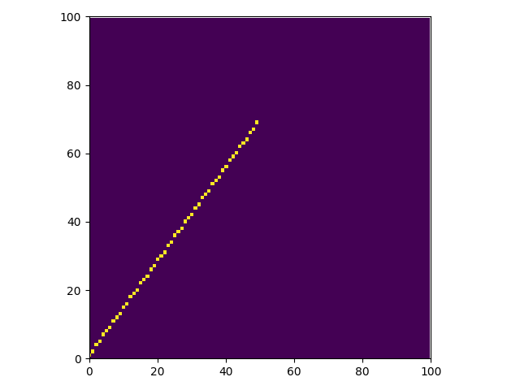


------

### 数值微分算法(DDA)

- 采用**“增量”**的思想

  - 当`|k|<=1`时，`x`每增加`1`，`y`增加`k`
  - 当`|k|>1`时，`y`每增加`1`，`x`增加`1/k`

- **证明:** *(这里只考虑`|k|<=1`当情况)*

  由$x_{i+1} = x_{i} + 1$

  $y_{i+1} = k*x_{i+1} + b = k*(x_{i}+1) + b = k*x_{i} + b + k = y_{i} + k$

```python
'''数值微分算法（DDA）'''
def drawLine_DDA(grid, start, end):
  k = (end.y - start.y) / (end.x - start.x)
  xi, yi = start.x, start.y

  if(abs(k<=1)):
    for xi in range(start.x, end.x):
      drawPixel(xi, int(yi+0.5), 1, grid)
      yi += k
  else:
    for yi in range(start.y, end.y):
      drawPixel(int(xi+0.5), yi, 1, grid)
      xi += 1/k
```


#### 如果不对k进行分类讨论

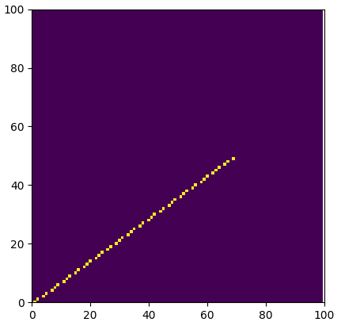

<center>不对k进行分类讨论</center>


<center>对k进行分类讨论</center>
------

### 中点画线法

- 设**直线方程**为：`ax + by + c =0`

  - `a = y0 - y1`
  - `b = x1 - x0`
  - `c = x0y1 - x1y0`

- **考核点：`**(xp+1, yp+0.5)`

- **判别式：**$\Delta = F(x_p+1, y_p+0.5) = a*(x_p+1) + b*(y_p+0.5) + c$

  - 如果$\Delta<0$ => Q点在M下方 => 选p2 `(x+1, y+1)`

  - else， 选p1 `(x+1, y)`

    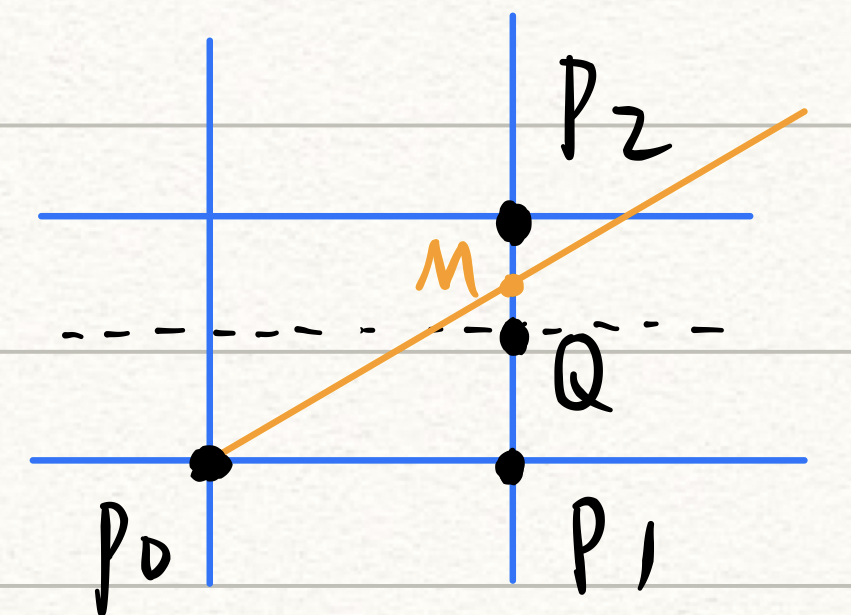

```python
'''中点画线法(k<=1)'''
def drwaLine_MidPoint(grid, start, end):
  a, b, c = start.y-end.y, end.x-start.x, start.x*end.y-end.x*start.y

  xp, yp = start.x, start.y
  for xp in range(start.x, end.x):
    drawPixel(xp, yp, 1, grid)

    delta = a*(xp+1) + b*(yp+0.5) + c   # 考核点(xp+1, yp+0.5)
    if delta<0:
      yp += 1
    else:
      # yp += 0
      pass
```


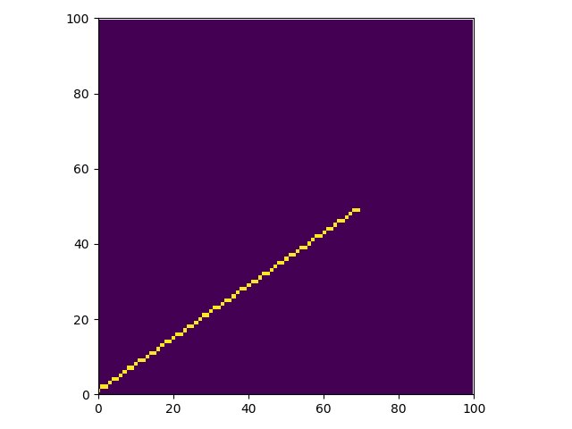

#### 在中点画线法中添加增量的思想

- 若取`p1`，增量为`a`
- 若取`p2`，增量为`a+b`
- **初值**：`d0 = a + 0.5*b`
- *由于只用`d`的符号来判断，可以用`2d`代替`d`，摆脱浮点数*

```python
'''中点画线法 with DDA'''
def drawLine_MidPoint_with_DDA(grid, start, end):
  a, b = start.y-end.y, end.x-start.x

  d = a + (b<<2)      # 用2d代替d， 摆脱小数
  d1, d2 = a<<2, (a+b)<<2

  xp, yp = start.x, start.y
  for xp in range(start.x, end.x):
    drawPixel(xp, yp, 1, grid)

    if d<0:
      yp += 1
      d += d2
    else:
      d += d1
```

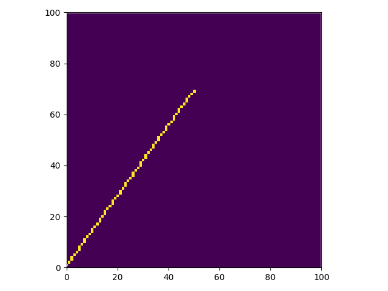


------

### Bresenham画线法

- 由**误差项符号**决定下一个像素选正右方还是右上方
- **判别式：**$\varepsilon = y_{i+1} - y_{i,r} - 0.5$
  - $\varepsilon > 0$, 取右上 `(x+1, y+1)`
  - else，取正右 `(x+1, y)`
- 引入**增量思想：**
  - $\varepsilon > 0$，增量为` k-1`
  - else，增量为 `k`
  - **初始值：**`-0.5`

```python
'''Bresenham画线法(k<=1)'''
def drawLine_Bresenham(grid, start, end):
  k = (end.y - start.y) / (end.x - start.x)
  x, y = start.x, start.y
  e = -0.5

  for x in range(start.x, end.x):
    drawPixel(x, y, 1, grid)

    if e > 0:
      e += k - 1
      y += 1
    else:
      e += k
      # y += 0
```


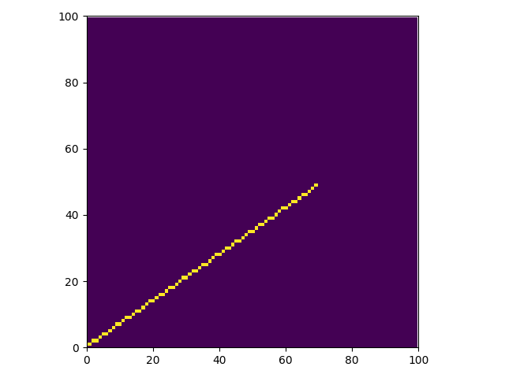

#### 去点浮

- 用$\varepsilon' = 2 * \varepsilon * dx$代替$\varepsilon$
- 去掉`k`的计算
- 引入**增量思想：**
  - $\varepsilon > 0$，增量为 `2(dy - dx)`
  - else，增量为 `2dy`
  - **初始值**：`-dx`

```python
'''Bresenham画线法(去点浮)(k<=1)'''
def drawLine_Bresenham_nonreal(grid, start, end):
    dx, dy = (end.x - start.x), (end.y - start.y)
    x, y = start.x, start.y
    e = -dx

    for x in range(start.x, end.x):
      drawPixel(x, y, 1, grid)

      if e > 0:
        e += (dy - dx) << 2
        y += 1
      else:
        e += (dy) << 2
        # y += 0
```


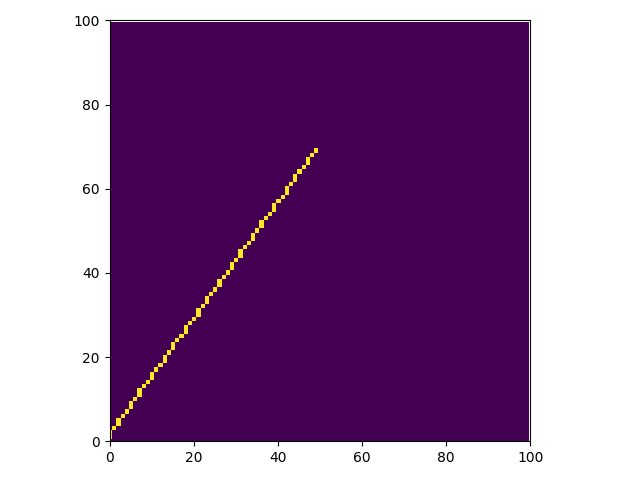

------

## 圆弧

### 暴力算法

- $y^2 = \sqrt{R^2 - x^2}$

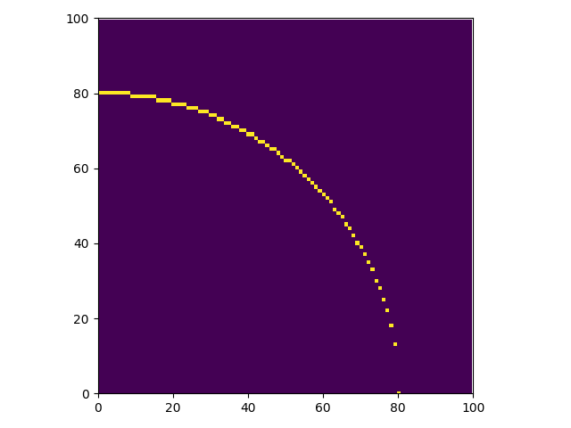

------

### 中点画圆法

- 只需画`1/8`圆（第一象限 `y>x` 部分）
- **判别式：**$F(x,y) = x^2 + y^2 - R^2$
  - `F>0`，取正右方 `(x+1, y)`
  - else，取右下方` (x+1, y-1)`
- **增量思想：**
  - `d<0`, 增量为 `2*x + 3`
  - else, 增量为 `2*(x-y) + 5`
  - **初始值：**`1.25 - R`
- **去点浮：**用`e = d - 0.25`代替 `d`
  - **初始值：**`e = 1-R`
  - **循环条件：**`d < 0` <=> `e < 0.25` <= `e`始终为整数 => `e < 0`

```python
'''中点画圆法(DDA)'''
def drawArc_MidPoint_with_DDA(grid, R):
  d = 1 - R

  x, y = 0, R
  while x < y:
    drawPixel_symmetry8(x, y, 1, grid)

    if d < 0:
      x += 1
      d += 2*x + 3
    else:
      x += 1
      y -= 1
      d += ((x-y) << 1) + 5
```

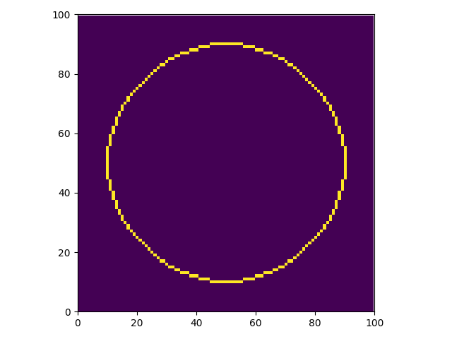

#### 对增量本身再次使用增量思想

- `x`递增1，`d`递增$\Delta x = 2$
- `y`递减1，`d`递增$\Delta\ y = 2$
- **初始值：**
  - $\Delta x = 3$
  - $\Delta\ y = -2r + 2$

```python
'''中点画圆法(DDA)(去点浮)'''
def drawArc_MidPoint_with_DDA_nonreal(grid, R):
  d = 1 - R
  deltax, deltay = 3, 2 - (R << 1)

  x, y = 0, R
  while x < y:
    drawPixel_symmetry8(x, y, 1, grid)

    if d < 0:
      x += 1
      d += deltax
      deltax += 2
    else:
      x += 1
      y -= 1
      d += (deltax + deltay)
      deltax += 2
      deltay += 2
```

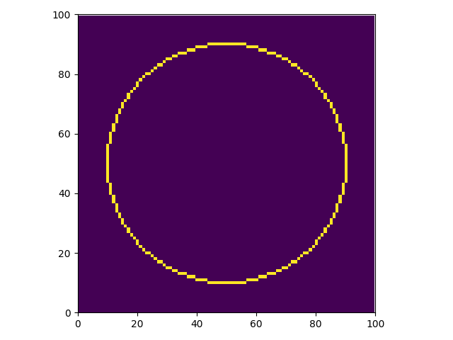

------

### Bresenham画圆法

- 选取距离真正的圆曲线近的点进行扩展

  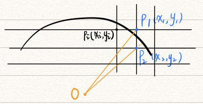

  如果`|OP1| > |OP2|`，则选`P2`

  <=> $\sqrt{x_1^2 + y_1^2 - R^2} > \sqrt{R^2 - x_2^2 - y_2^2}$

  <=> $x_1^2 + y_1^2 + x_2^2 + y_2^2 - 2R^2 > 0$

- 当前像素的下一个扩展节点：<u>正右方</u>、<u>右下方</u>、<u>正下方</u>

  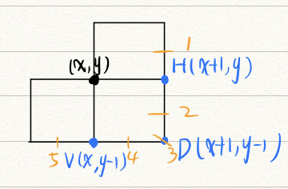

  1. 取`H`
  2. 在`H`、`D`中选更近的
  3. 取`D`
  4. 在`V`、`D`中选更近的
  5. 取`V`

- 令$\Delta H = |OH|$, $\Delta D = |OD|$, $\Delta V = |OV|$

  令$\delta HD = |\Delta H| - |\Delta D| = |OH| - |OD|$, $\delta DV = |\Delta D| - |\Delta V|$

  2. $\delta HD = 2\Delta D + 2y - 1$

  4. $\delta DV = 2\Delta D - 2x - 1$
     - $\Delta D > 0$，若$\delta DV <= 0$，取`D`；else取`V`
     - $\Delta D < 0$，$\delta HD <= 0$，取`H`；else，取`D`
     - $\Delta D = 0$，取`D`

- 用增量法简化$\Delta D$，下一个像素取：

  - `H`，增量取`2x + 1`
  - `D`，增量取`2x - 2y + 2`
  - `V`，增量取`-2y + 1`
  - 初始值：`-2r + 2`

```python
'''Bresenham画圆法'''
def drawArc_Bresenham(grid, R):
    delta = (1 - R) << 1

    x, y = 0, R
    while y >= 0:
        drawPixel_symmetry4(x, y, 1, grid)

        if delta < 0:
            delta1 = ((delta + y) << 1) - 1
            if delta1 <= 0:
                direction = 1
            else:
                direction = 2
        elif delta > 0:
            delta2 = ((delta - x) << 1) - 1
            if delta2 <= 0:
                direction = 2
            else:
                direction = 3
        else:
            direction = 2


        if direction == 1:      # 前进到 正右
            x += 1
            delta += (x << 1) + 1
        elif direction == 2:    # 前进到 右下
            x += 1
            y -= 1
            delta += ((x - y) << 1) + 2
        else:                   # 前进到 正下
            y -= 1
            delta += 1 - (y << 1)
```


------

### 正负法

- 圆方程：$F(x,y) = x^2 + y^2 - R^2$
- 设$P(x_i, y_i)$
  - `P`在圆内 -> $D(x_i,y_i) <= 0$ -> 向右
  - `P`在圆外 -> $D(x_i,y_i) > 0$ -> 向下
- 引入**增量思想：**
  - 当`F<=0`，增量为`2x + 1`
  - else，增量为`-2y + 1`
  - **初始值：**`0`

```python
'''正负法'''
def drawArc_PositiveNegative(grid, R):
    F = 0

    x, y = 0, R
    while x <= y:
        drawPixel_symmetry8(x, y, 1, grid)
        print(F)
        if F <= 0:
            F += (x << 1) + 1
            x += 1
        else:
            F += 1 - (y << 1)
            y -= 1
```

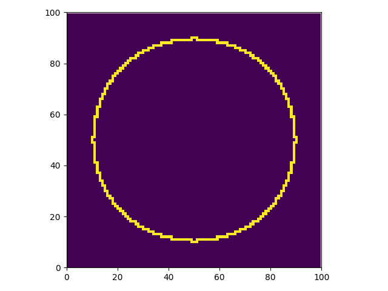