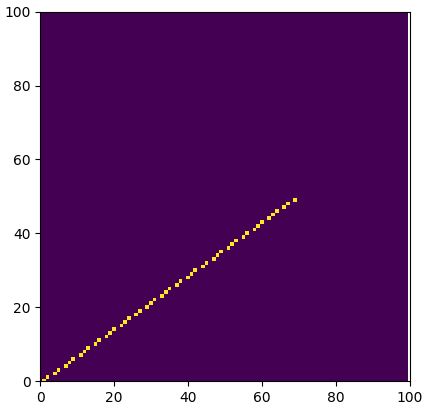
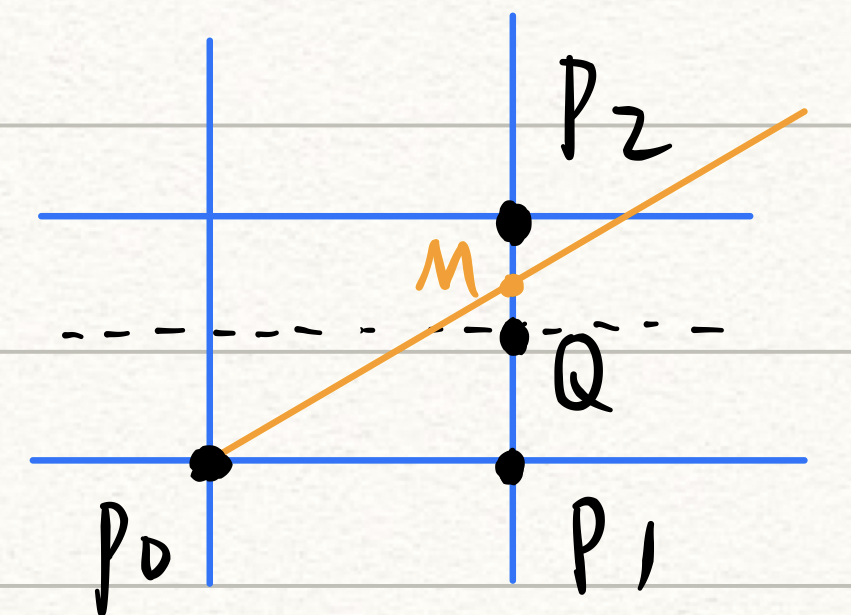

# 基本图形生成算法

[TOC]

------

## 直线段

### 基础算法

计算斜率和截距，通过`y = kx + b`的直线表达式计算每一个x对应的y值

```python
'''基础算法'''
def drawLine_Basic(grid, start, end):
  k = (end.y-start.y)/(end.x-start.x)
  b = start.y - k * start.x

  for xi in range(start.x, end.x):    # 栅格的性质
    yi = k * xi + b
    drawPixel(xi, int(yi+0.5), 1, grid)     # y坐标要进行近似
```

------

### 数值微分算法(DDA)

- 采用“增量”的思想

  - 当`|k|<=1`时，x每增加1，y增加k
  - 当`|k|>1`时，y每增加1，x增加1/k

- 证明: (这里只考虑`|k|<=1`当情况)

  由$x_{i+1} = x_{i} + 1$

  $y_{i+1} = k*x_{i+1} + b = k*(x_{i}+1) + b = k*x_{i} + b + k = y_{i} + k$

```python
'''数值微分算法（DDA）'''
def drawLine_DDA(grid, start, end):
  k = (end.y - start.y) / (end.x - start.x)
  xi, yi = start.x, start.y

  if(abs(k<=1)):
    for xi in range(start.x, end.x):
      drawPixel(xi, int(yi+0.5), 1, grid)
      yi += k
  else:
    for yi in range(start.y, end.y):
      drawPixel(int(xi+0.5), yi, 1, grid)
      xi += 1/k
```

#### 如果不对k进行分类讨论



<center>不对k进行分类讨论</center>


<center>对k进行分类讨论</center>
------

### 中点画线法

- 设直线方程为：ax + by + c =0

  - a = y0 - y1
  - b = x1 - x0
  - c = x0y1 - x1y0

- 考核点：(xp+1, yp+0.5)

- 判别式：$\Delta$ = F(xp+1, yp+0.5) = a*(xp+1) + b*(yp+0.5) + c

  - 如果$\Delta$<0 => Q点在M下方 => 选p2

  - else， 选p1

    

```python
'''中点画线法'''
def drwaLine_MidPoint(grid, start, end):
  a, b, c = start.y-end.y, end.x-start.x, start.x*end.y-end.x*start.y

  xp, yp = start.x, start.y
  for xp in range(start.x, end.x):
    drawPixel(xp, yp, 1, grid)

    delta = a*(xp+1) + b*(yp+0.5) + c   # 考核点(xp+1, yp+0.5)
    if delta<0:
      yp += 1
    else:
      # yp += 0
      pass
```

------

#### 在中点画线法中添加增量的思想

- 若取p1，增量为a
- 若取p2，增量为a+b
- 初值：d0 = a + 0.5b
- 由于只用d的符号来判断，可以用2d代替d，摆脱浮点数

```python
'''中点画线法 with DDA'''
def drawLine_MidPoint_with_DDA(grid, start, end):
  a, b = start.y-end.y, end.x-start.x

  d = a + (b<<2)      # 用2d代替d， 摆脱小数
  d1, d2 = a<<2, (a+b)<<2

  xp, yp = start.x, start.y
  for xp in range(start.x, end.x):
    drawPixel(xp, yp, 1, grid)

    if d<0:
      yp += 1
      d += d2
    else:
      d += d1
```

